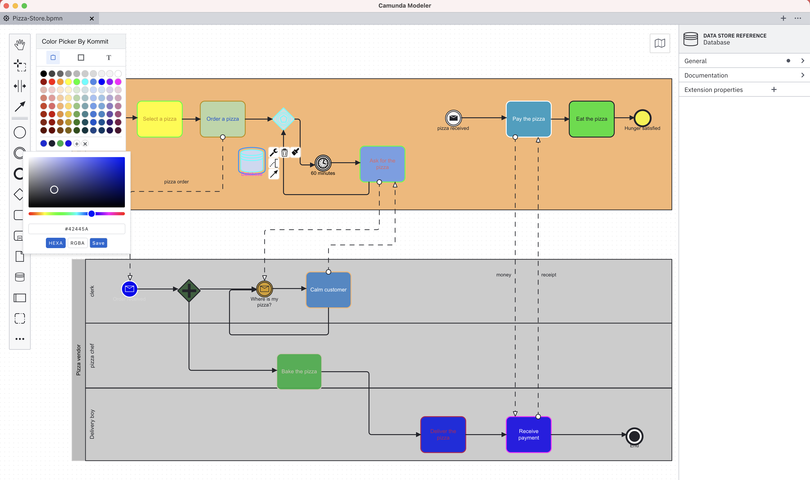

# Kommit Color Picker Plugin for the Camunda Modeler

Camunda Modeler plugin that adds a flexible color picker to the toolbar, allowing you to easily apply preset colors to your BPMN elements.




## Description

This plugin provides a floating, draggable color picker panel that enhances the modeling experience by offering a quick way to style elements. It is particularly useful for creating heatmaps, highlighting process flows, or simply organizing your diagram with visual cues.

## Features

*   **Three Coloring Modes:**
    *   **Fill (Background):** Changes the background color of the selected element.
    *   **Stroke (Border):** Changes the border color of the selected element.
    *   **Text:** Changes the color of the element's label.
*   **Preset Palette:** A curated selection of colors arranged in a grid for consistent styling across your diagrams.
*   **Draggable Interface:** The color picker panel can be dragged anywhere on the canvas, ensuring it's always accessible but never in the way.

## Installation

1.  Download or clone this repository.
2.  Copy the `kommit-color-picker-plugin` folder into the `plugins` directory of your Camunda Modeler installation.
    *   MacOS: `~/Library/Application Support/camunda-modeler/resources/plugins`
    *   Windows: `%APPDATA%/camunda-modeler/resources/plugins`
    *   Linux: `~/.config/camunda-modeler/resources/plugins`
3.  Restart the Camunda Modeler.

## Usage

1.  **Open the Color Picker:**
    *   Click the "Toggle Color Picker" option in the `Plugins` menu.
    *   Or use the keyboard shortcut: `Cmd + Shift + P` (Mac) or `Ctrl + Shift + P` (Windows/Linux).
2.  **Select an Element:** Click on a BPMN element in the diagram to select it.
3.  **Choose a Mode:** Use the icons in the color picker toolbar to switch between Fill, Stroke, or Text mode.
4.  **Pick a Color:** Click any color in the grid to apply it to the selected element.

## Development

If you want to modify or extend the plugin, follow these steps:

### Prerequisites

*   Node.js installed on your machine.

### Setup

1.  Clone the repository to your local machine:
    ```sh
    git clone git@github.com:kommit-co/kommit-color-picker-plugin.git
    cd kommit-color-picker-plugin
    ```
2.  Install dependencies:
    ```sh
    npm install
    ```

### Build

*   **One-time build:**
    ```sh
    npm run client
    ```
    This bundles the client-side code into `client/client-bundle.js`.

*   **Watch mode (for development):**
    ```sh
    npm run dev
    ```
    This watches for changes and rebuilds the bundle automatically.

## Compatibility

This plugin is compatible with Camunda Modeler versions that support `bpmn-js`. It uses `camunda-modeler-plugin-helpers` to register with the application.

## License

MIT

